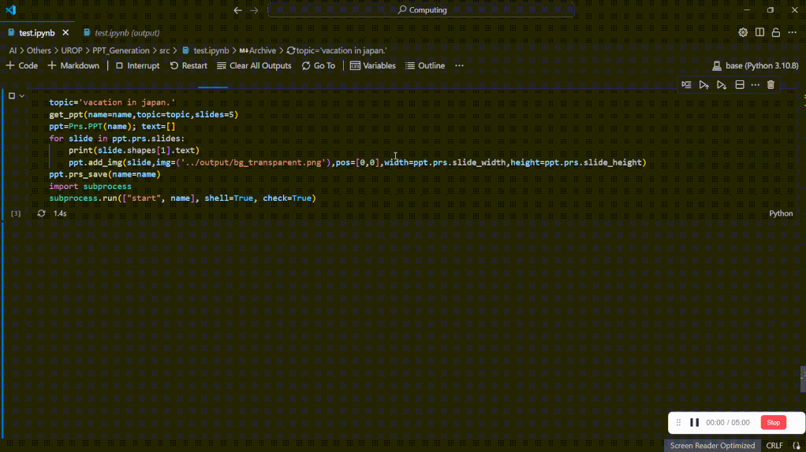

# LG-PPT-Generation
This project introduces an innovative automated system to streamline presentation creation. Leveraging foundational AI models, it processes inputs, formulates text, and generates related graphics. A layout module then arranges these into a structured PowerPoint presentation.

# Introduction
Presentations are a cornerstone of professional and academic communication, serving as a bridge between knowledge and audience. Yet, the act of designing a presentation can be daunting and labor-intensive. Recognizing this, the present project introduces a method underpinned by artificial intelligence, aiming to modestly enhance the process of presentation creation.

At the heart of our approach is a user-centric system that welcomes input instructions to be interpreted by AI. Acknowledging the capabilities and limits of current technology, we employ large language models to analyze these instructions for semantic content, and foundation AI models, like LLM and other Generative AI, to generate textual and visual elements relevant to the given topic.

The project does not claim to replace the nuanced creativity of human designers but strives to provide a supplementary tool. It seeks to reduce the burden of routine aspects of presentation design, such as drafting initial content and visuals generation, by employing a layout generation module that thoughtfully places generated content into a PowerPoint format.

# Environment setup
`cd LG-PPT-Generation;`
`pip install -r requirements.txt`
